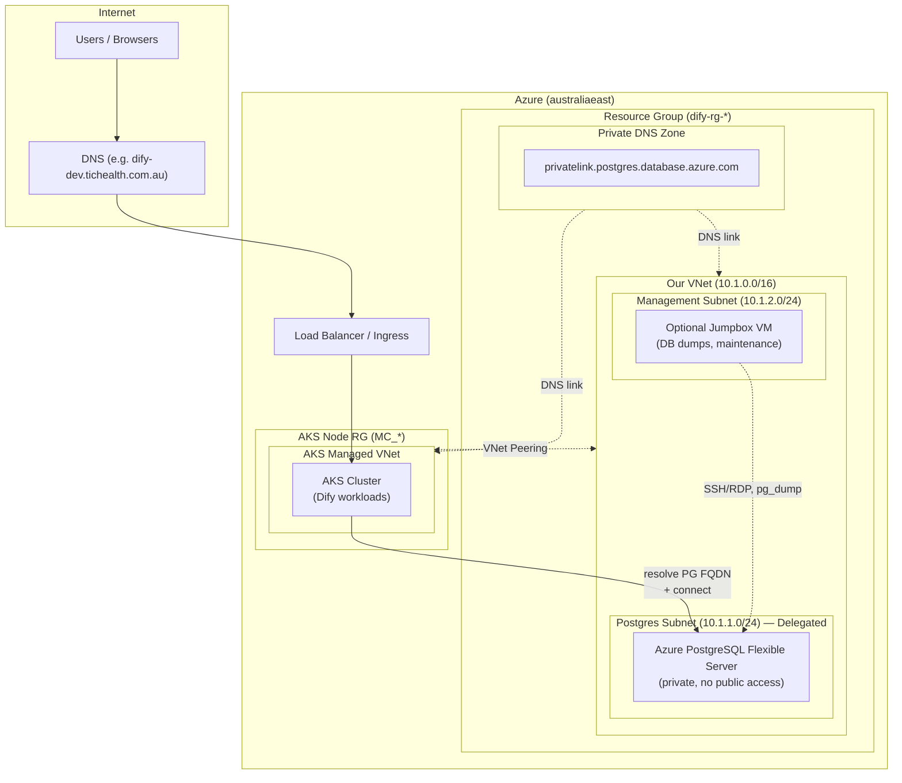
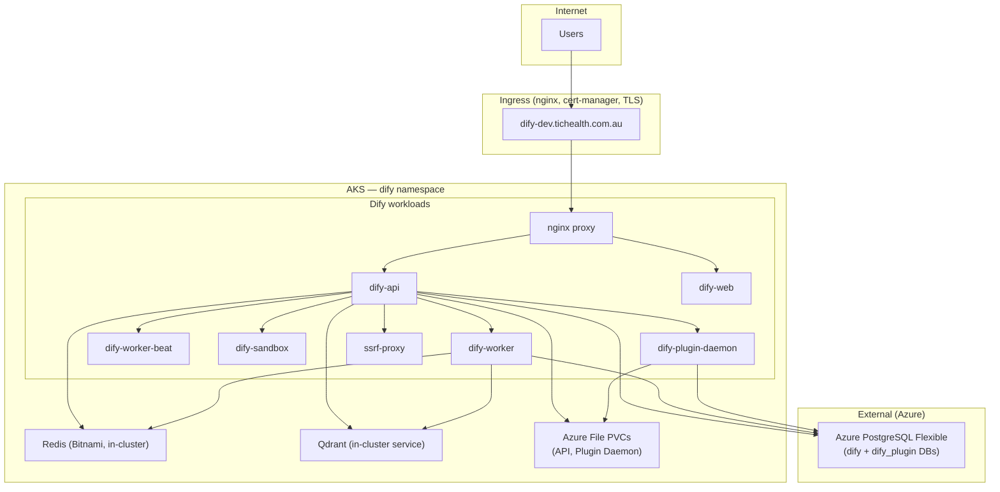

# Dify on AKS – Architecture (Dev, Test, Prod)

Diagram-as-code for the current design. All environments share the same logical architecture; scale and options differ by env (see [Environment comparison](#environment-comparison)).

---

## Future TODO (parked)

- **Single VNet migration**: Move AKS to a **custom VNet** (advanced networking) so AKS and PostgreSQL share one VNet with different subnets. Remove VNet peering and AKS VNet discovery. Simpler architecture; no meaningful cost or latency change vs current same-region peering.

---

## 1. Infrastructure / Network (Azure)

When `create_vnet_for_postgres = true` (e.g. Dev). Test/Prod may use public PostgreSQL or the same private setup.

**Key points:**

- **Our VNet**: Postgres subnet (delegated for Flexible Server), management subnet (optional jumpbox). NSG on management: SSH/RDP inbound, outbound to Postgres.
- **AKS VNet**: Azure-managed, created by AKS. We discover it via `azurerm_resources` and peer + link DNS.
- **Private DNS Zone**: Resolves `*.privatelink.postgres.database.azure.com` inside both VNets. AKS pods use it to reach PostgreSQL.
- **Peering**: Bidirectional between our VNet and AKS VNet so pods can reach Postgres.

---

## 2. Application (Dify on AKS)

**Key points:**

- **PostgreSQL**: Azure Flexible Server (external). Main DB `dify`, plugin DB `dify_plugin`. Private FQDN when VNet is used.
- **Redis**: In-cluster (Bitnami subchart). Single node in Dev; replicas configurable for Test/Prod.
- **Qdrant**: In-cluster service (`dify-qdrant:6333`) for vector store.
- **Storage**: Azure File PVCs for API and Plugin Daemon; `azurefile` StorageClass.
- **Ingress**: ClusterIP service; external access via Ingress (nginx, TLS). Terraform does not create LB; Ingress controller uses a LoadBalancer or equivalent.

---

## 3. Environment comparison

| Aspect | Dev | Test | Prod |
|--------|-----|------|------|
| **AKS nodes** | 1, `Standard_D2ads_v6` | 1, `Standard_D2s_v5` | 3, `Standard_D4s_v5` |
| **Spot pool** | No | Yes (optional) | No |
| **PostgreSQL** | B1ms, 32GB, private subnet (VNet) | B1ms, 32GB, often public | GP D2ds_v5, 128GB, higher IOPS; optional replica |
| **VNet / private PG** | Yes (`create_vnet_for_postgres`) | Optional (propagate from Dev) | Optional (propagate from Dev) |
| **Management subnet** | Yes (optional jumpbox) | Same if VNet used | Same if VNet used |
| **Region** | australiaeast | australiaeast | australiaeast |

---

## 4. Terraform / Helm

- **Terraform**: RG, AKS, VNet, subnets, NSG, Private DNS Zone, DNS links, peering, PostgreSQL Flexible Server, DBs, extensions. No Kubernetes resources.
- **Helm (deploy.sh)**: Dify chart + Redis, Qdrant, Ingress. `postgresql_fqdn` and related settings come from Terraform outputs.
- **State**: Remote backend (e.g. Azure Blob) when configured via backend block.

---

*Diagrams are Mermaid. Render in GitHub, VS Code (Mermaid extension), or [mermaid.live](https://mermaid.live).*
