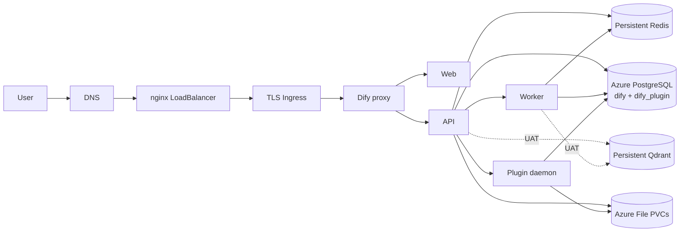

# Dify on AKS architecture

**Last reconciled:** 2026-08-03 against the environment profiles and live Dev /
Lite Prod inventory. Environment runbooks and Terraform/Helm remain the source of
truth.

## Runtime topology

```mermaid
flowchart LR
    User --> DNS --> LB[nginx LoadBalancer]
    LB --> Ingress[TLS Ingress] --> Proxy[Dify proxy]
    Proxy --> Web
    Proxy --> API
    API --> Worker
    API --> Plugin[Plugin daemon]
    API --> Redis[(Persistent Redis)]
    Worker --> Redis
    API --> PG[(Azure PostgreSQL\ndify + dify_plugin)]
    Worker --> PG
    Plugin --> PG
    API --> Files[(Azure File PVCs)]
    Plugin --> Files
    API -. UAT .-> Qdrant[(Persistent Qdrant)]
    Worker -. UAT .-> Qdrant
```

- nginx-ingress exposes one environment-specific hostname; cert-manager issues
  its Let's Encrypt certificate.
- Azure PostgreSQL Flexible Server holds the Dify and plugin databases.
- Redis is a persistent, single-master in-cluster release.
- API and plugin file data is on Azure File PVCs. Azure Blob variables are not
  wired to application file storage.
- UAT deploys Qdrant as a persistent in-cluster release. Existing Dev and Lite
  Prod do not currently have a Qdrant Helm release; that needs a separate data
  and migration decision.

## Environment differences

| Aspect | Dev (live) | UAT profile | Lite Prod (live) | Full Prod profile |
| --- | --- | --- | --- | --- |
| AKS | 1 x D2s_v5 | 1 x D2s_v5 | 1 x D4s_v5 | 3 x D4s_v5 |
| Spot | No | No | No | No |
| PostgreSQL | PG16 B1ms, 32 GiB | PG16 B1ms, 32 GiB | PG16 B1ms, 32 GiB | PG16 GP D2ds_v5, 128 GiB |
| PostgreSQL network | Private VNet | Public initially | Public | Public |
| PostgreSQL TLS | Existing profile disabled | Required | Existing profile disabled | Required |
| Qdrant release | Not present | Included | Not present | Not currently automated |
| Availability intent | Development | Compatibility/acceptance | Cost-optimized production | Node-level resilience |

UAT deliberately mirrors the service types and configuration shape of Prod while
using Dev-sized compute. One-node profiles are not highly available.

## Network variants

Dev uses a delegated PostgreSQL subnet, private DNS zone, and peering to the
AKS-managed VNet. `coredns-custom.yaml` forwards the PostgreSQL public DNS zone to
Azure DNS (`168.63.129.16`) without replacing the AKS-managed CoreDNS ConfigMap.

UAT and current Lite Prod use public PostgreSQL so GitHub-hosted runners and AKS
can reach the server. UAT requires TLS but temporarily uses an allow-all firewall
rule. Moving it to private networking requires a private/self-hosted runner or an
approved bootstrap path.

## Ownership boundaries

| Owner | Manages |
| --- | --- |
| Terraform | Resource group, AKS, networking, PostgreSQL, databases, extensions |
| `deploy.sh` / Helm | ingress-nginx, optional cert-manager reconciliation, Dify, Redis, and UAT Qdrant |
| Azure CLI operator | Kubernetes version upgrades |
| DNS operator | Environment hostname A record |
| Dify administrator | Admin account, providers, apps/workflows, API keys, sanitized test data |

Terraform state is stored in an Azure Blob backend with a separate key per
environment. The backend account is control-plane storage, not Dify file storage.
